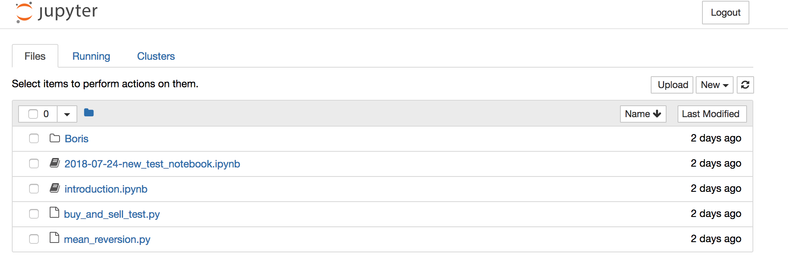

Crypto Algorithmic Trading Notebook
====================================


This is a setup for a basic crypto algorithic trading setup.

We use a few technologies:

* [Docker](https://www.docker.com/)
* [Jupyter docker setup](http://jupyter-docker-stacks.readthedocs.io/en/latest/)
* [Catalyst](https://enigma.co/catalyst/install.html)


## Getting started

You will require to install Docker on your local setup.  Follow instructions at

https://docs.docker.com/install/#nightly-builds

To setup.  Note that you might want to ensure you have [more than 2Gb of memory for the container](https://docs.docker.com/config/containers/resource_constraints/).

After that, clone the repository.

Run the following in the repository's folder.
```
make build
```

## Run the notebook


```
make run
```

The console will output the following:

```
    Copy/paste this URL into your browser when you connect for the first time,
    to login with a token:
        http://localhost:8888/?token=xxx
```

Do as told, and you should be presented with the notebook environment



Now proceed with the tutorial at [here](http://opentechschool.github.io/python-data-intro/core/notebook.html#first-steps-with-notebook) to learn more about how to interact with the notebook.
